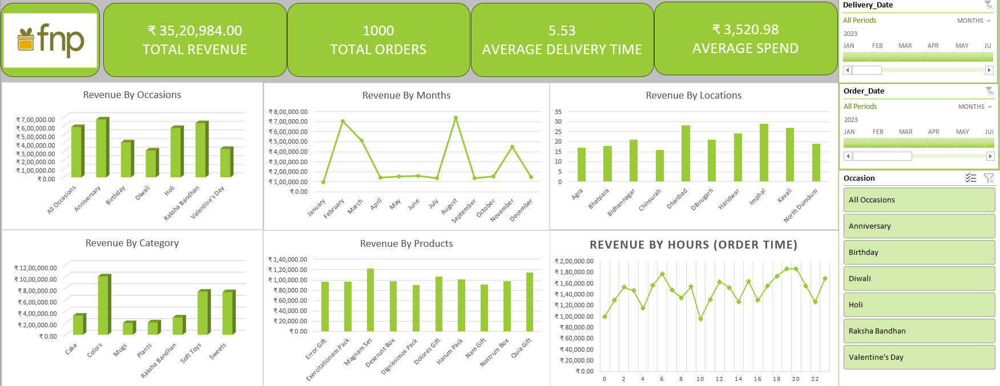

# FNP Sales & Revenue Analytics Dashboard

## Project Overview

This project presents an interactive Sales & Revenue Analytics Dashboard developed for Ferns N Petals (FNP). The dashboard provides insights into sales performance, customer purchasing behavior, delivery efficiency, product performance, and geographical revenue distribution.

## Dashboard Preview

.

---

## Key KPIs

- Total Revenue: ₹35,20,984
- Total Orders: 1000
- Average Delivery Time: 5.53 Days
- Average Spend: ₹3,520.98

---

## Features

### Revenue Analysis
- Revenue by Occasion
- Revenue by Month
- Revenue by Location

### Product Analysis
- Revenue by Category
- Revenue by Products

### Customer Insights
- Revenue by Order Time
- Average Customer Spend

### Interactive Filters
- Delivery Date
- Order Date
- Occasion Filter

---

## Business Insights

- Anniversary generated the highest revenue.
- Revenue peaks during February and August.
- Colors and Soft Toys are top-performing categories.
- Evening hours show maximum order activity.
- Certain cities contribute significantly higher revenue.

---

## Tools Used

- Microsoft Excel
- Pivot Tables
- Pivot Charts
- Power Query Editor
- Power Pivot
- Measures
- Slicers
- Data Visualization
- Dashboard Design

---

## Business Impact

The dashboard helps management:

- Monitor sales performance
- Identify profitable products
- Optimize inventory planning
- Improve marketing strategies
- Support data-driven decision making

---

## Author

Piyush Kukreja

LinkedIn: www.linkedin.com/in/piyush-kukreja-735918259

GitHub: https://github.com/Piyush972004
